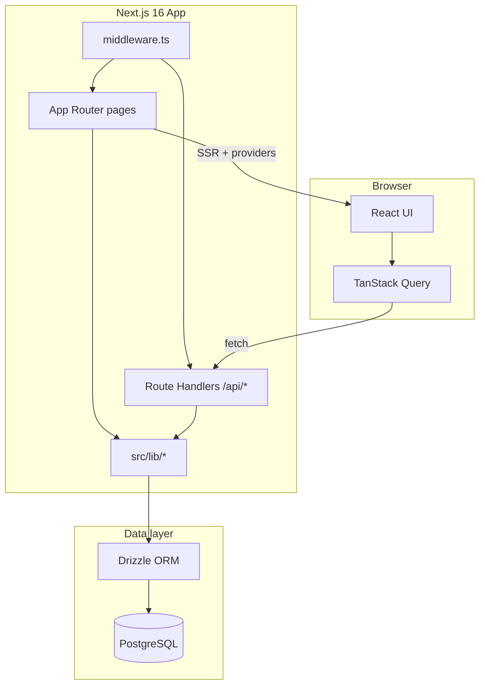
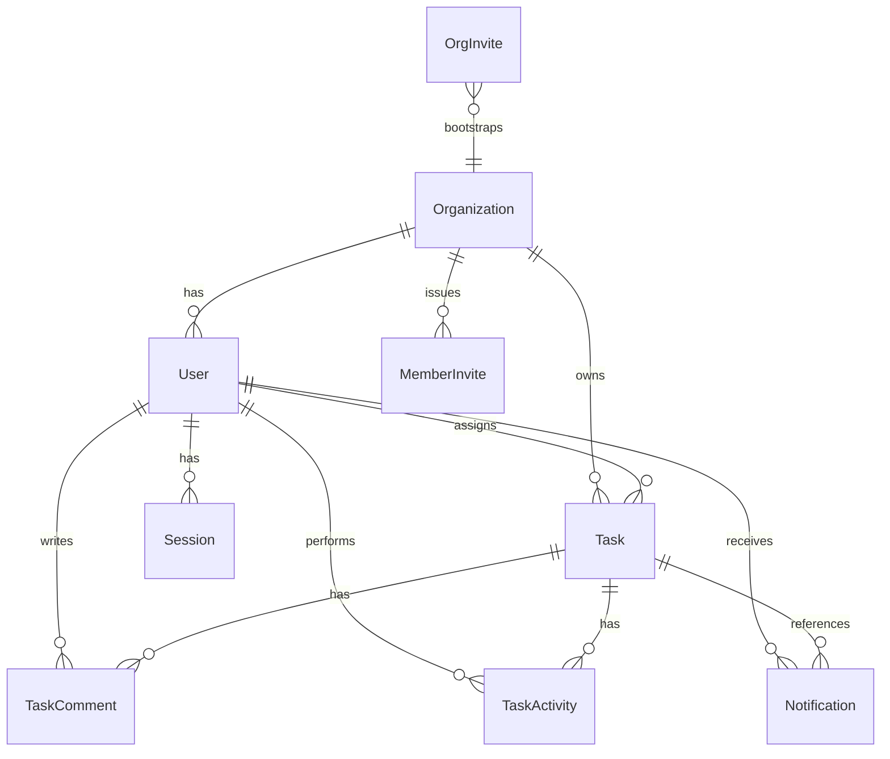
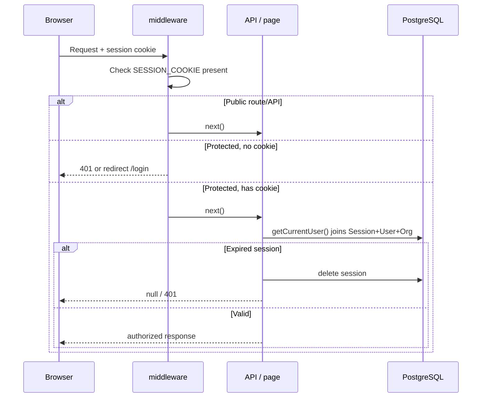
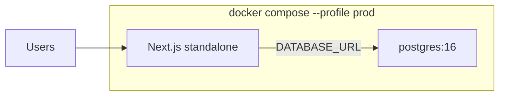

# Mini Linear — Architecture

A lightweight, multi-tenant task board inspired by Linear. Each **organization** is an isolated workspace; users belong to exactly one org and collaborate on shared tasks.

## System context



## Tech stack

| Layer | Choice |
|-------|--------|
| Framework | Next.js 16 (App Router) |
| UI | React 19, Tailwind CSS 4, shadcn/ui, Base UI |
| State | TanStack Query + React context providers |
| Database | PostgreSQL 16 |
| ORM | Drizzle ORM + SQL migrations in `drizzle/` |
| Auth | Custom sessions (bcrypt + httpOnly cookie) |
| DnD | @dnd-kit (kanban reorder) |
| Validation | Zod |
| IDs | CUID2 (`@paralleldrive/cuid2`) |
| Deploy | Docker (standalone Next.js build + Postgres) |

## Multi-tenancy model

Tenancy is **organization-scoped**, not row-level-security in Postgres:

- Every `User` belongs to one `Organization`.
- Every `Task` has `organizationId`; all task queries filter by the current user's org.
- `getOrganizationTask()` in `src/lib/task-access.ts` enforces org boundaries on single-task reads.
- Assignees must be members of the same org (`isAssigneeInOrganization()`).

There is no cross-org access. Middleware ensures authenticated API access; route handlers call `requireUser()` / `requireAdmin()` for authorization.

## Data model



### Core entities

| Entity | Purpose |
|--------|---------|
| `Organization` | Workspace (name, unique slug) |
| `User` | Member with role `ADMIN` or `MEMBER` |
| `Session` | Server-side session row; cookie stores session id |
| `Task` | Issue with status, priority, position, assignee, due date |
| `TaskActivity` | Audit trail (created, status/assignee/priority/due-date changes) |
| `TaskComment` | Thread on a task |
| `Notification` | In-app alerts (`ASSIGNED`, `COMMENT`, `STATUS_CHANGED`) |
| `OrgInvite` | One-time token to create a new organization |
| `MemberInvite` | Admin-issued token to join an existing org |

### Task lifecycle

- **Statuses**: `BACKLOG` → `TODO` → `IN_PROGRESS` → `DONE` | `CANCELED`
- **Position**: integer per `(organizationId, status)` for kanban/list ordering
- **Completed tasks**: `completedAt` set when status becomes `DONE`; cleared when moved out of `DONE`
- **Visibility**: tasks in `DONE` for more than 24h are hidden from main views (`src/lib/task-visibility.ts`) and shown on `/completed`

## Authentication & authorization



- **Session cookie**: `SESSION_COOKIE` from `src/lib/auth-constants.ts`, httpOnly, 30-day TTL
- **Password hashing**: bcrypt (cost 12)
- **Roles**: `ADMIN` can manage members and invites; `MEMBER` has full task access within the org
- **Public routes**: `/`, `/login`, `/register`, `/join/*`
- **Public APIs**: `/api/auth/*`, `/api/invites/*`, `/api/members/invites/*` (token validation), `/api/health`

### Invite flows

| Flow | Entry | Creates |
|------|-------|---------|
| Org bootstrap | CLI `npm run invite:create-org` → `/register/[token]` | New org + admin user |
| Member join | Admin UI `/settings/members` → `/join/[token]` | New `MEMBER` in existing org |

Invite links use `APP_URL`; links are logged/copied manually (email delivery via Resend is planned).

## Request & data flow

### Server-rendered app shell

`(app)/layout.tsx` is the protected layout. On each navigation it:

1. Calls `getCurrentUser()` (React `cache()`-deduped)
2. Loads org members, tasks, and notifications in parallel
3. Wraps children in providers: `QueryProvider` → `SessionProvider` → `MembersProvider` → `TasksProvider` → `NotificationsProvider` → `AppShell`

Initial data is passed as `initialData` / `initialTasks` into TanStack Query so the client hydrates without a loading flash.

### Client mutations

UI components use hooks (`useTasks`, `useMembers`, etc.) backed by context providers. Mutations call `src/lib/api.ts` fetch helpers, which hit `/api/*` route handlers. Providers optimistically update query cache and invalidate related keys (e.g. issue detail after task update).

### Issue detail (intercepting route pattern)

- URL: `/issues/[id]`
- `(app)/issues/layout.tsx` parses the path and renders `IssueDetailRoute` as a full-page overlay
- Data: `GET /api/tasks/[id]/detail` (task + comments + activity)
- Cached under `queryKeys.issueDetail(taskId)`

## Routing map

| Route group | Paths | Notes |
|-------------|-------|-------|
| Public | `/`, `/login`, `/register`, `/register/[token]`, `/join/[token]` | Auth pages |
| App | `/board`, `/inbox`, `/my-issues` | Primary views |
| Workspace issues | `/list`, `/active`, `/backlog`, `/completed` | Shared `WorkspaceIssuesView` layout |
| Issue detail | `/issues/[id]` | Client layout intercept |
| Settings | `/settings/workspace`, `/settings/members` | Admin-focused |
| API | `/api/*` | REST-style route handlers |

## API surface

| Area | Endpoints | Auth |
|------|-----------|------|
| Auth | `POST /api/auth/login`, `register`, `logout` | Public (register needs invite) |
| Tasks | `GET/POST /api/tasks`, `PATCH/DELETE /api/tasks/[id]`, `POST /api/tasks/reorder`, comments, activity, detail | User |
| Members | `GET /api/members`, `DELETE /api/members/[id]`, invites CRUD | User / Admin |
| Notifications | `GET /api/notifications`, `PATCH /[id]`, `POST /read-all` | User |
| Health | `GET /api/health` | Public |

Route handlers follow a consistent pattern:

1. `withApiRoute()` wrapper for structured logging
2. `requireUser()` or `requireAdmin()`
3. Zod validation via `src/lib/validations.ts`
4. Org-scoped DB access
5. Side effects in transactions (activity records, notifications)

## Frontend architecture

```
src/
├── app/           Route segments + API route handlers
├── components/    UI (feature folders: kanban, list, issues, inbox, settings, ui)
├── hooks/         Thin wrappers over providers / issue detail
├── db/schema.ts   Single source of truth for DB types
└── lib/           Server logic, API client, auth, domain helpers
```

**UI conventions**

- Dark theme, Geist fonts, `AppSidebar` for navigation
- `AppShell` + collapsible sidebar (mobile overlay)
- shadcn/ui primitives in `src/components/ui/`
- Kanban: `@dnd-kit` with optimistic reorder via `persistReorder()`

**State ownership**

| Concern | Mechanism |
|---------|-----------|
| Session / user | `SessionProvider` (SSR seed) |
| Tasks | `TasksProvider` + `queryKeys.tasks` |
| Members | `MembersProvider` |
| Notifications | `NotificationsProvider` (polls every 30s) |
| Issue detail | Per-id query via `useIssueDetail` |

## Observability

- `src/lib/logger.ts`: structured JSON logs in production, readable lines in dev
- `logServerCall`, `logPageRender`, `withApiRoute` wrap server work with timing
- Slow calls (>500ms) logged at warn level
- `LOG_LEVEL` env: `debug` | `info` | `warn` | `error`
- `src/instrumentation.ts`: warms DB pool on Node.js startup

## Database & migrations

- Schema: `src/db/schema.ts`
- Migrations: `drizzle/*.sql`, journal in `drizzle/meta/`
- Workflow: edit schema → `npm run db:generate` → `npm run db:migrate`
- `src/lib/db.ts`: lazy pool via Proxy (build works without `DATABASE_URL`), connection retry via `withDbRetry()`
- Docker entrypoint runs migrations before `node server.js`

## Deployment



- `docker compose up` (default): Postgres only on port 5433
- `npm run docker:prod`: builds app image, runs migrations, exposes port 3000
- Required env: `DATABASE_URL`, `APP_URL`
- Health check: `GET /api/health`

## Design decisions

1. **Custom auth over NextAuth/Clerk** — simpler invite-only onboarding, full control over session table
2. **Full org task load** — all tasks fetched once per layout; acceptable for small workspaces; filters applied client-side
3. **No open registration** — org creation requires CLI invite; members require admin invite
4. **Activity + notifications in DB** — not event-sourced; written synchronously in task mutations
5. **Completed task archival** — client-side 24h rule keeps main views clean without a separate archive table

## Extension points

| Feature | Likely touch points |
|---------|---------------------|
| Email invites | `src/lib/invite-utils.ts`, Resend integration |
| Real-time updates | SSE/WebSocket + invalidate query keys |
| Larger workspaces | Paginated `/api/tasks`, server-side filters |
| More roles | `userRoleEnum`, `requireAdmin()`, settings UI |
| File attachments | New table + storage provider |
